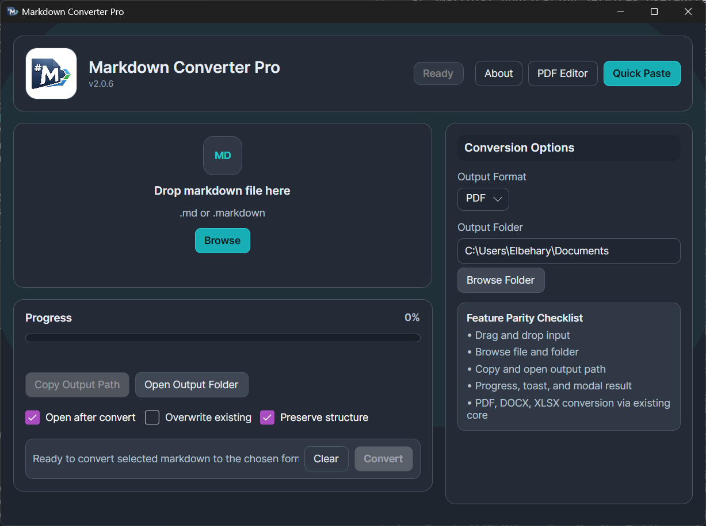
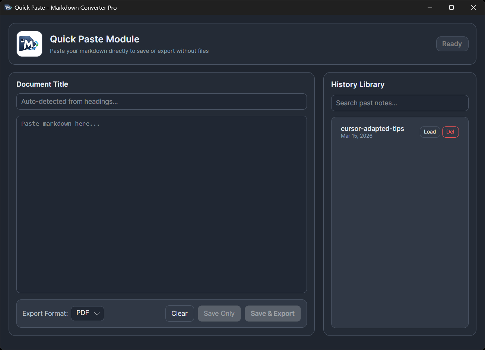
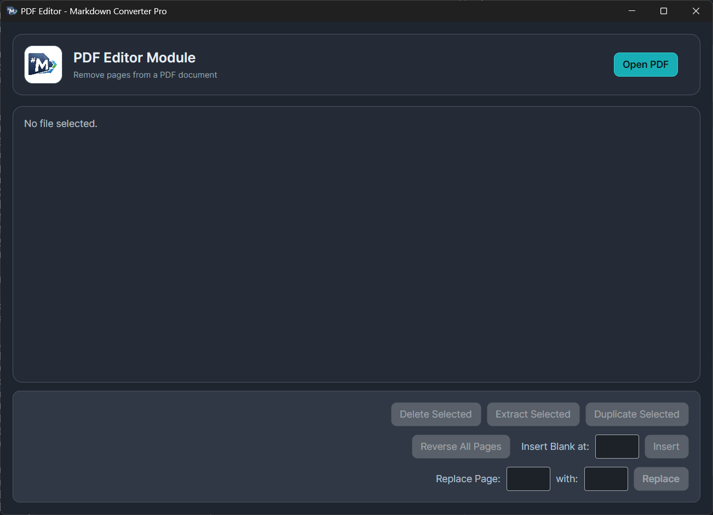

# Markdown Converter Pro

<p align="center">
  
</p>

<p align="center">
  <a href="https://github.com/AhmedElbehary-Dev/MarkdownConverter/actions/workflows/ci.yml"></a>
  <a href="https://github.com/AhmedElbehary-Dev/MarkdownConverter/actions/workflows/release.yml"></a>
  <a href="https://github.com/AhmedElbehary-Dev/MarkdownConverter/actions/workflows/codeql.yml"></a>
  <a href="https://github.com/AhmedElbehary-Dev/MarkdownConverter/releases"></a>
</p>

<p align="center">
  
  
  
  <a href="SECURITY.md"></a>
  <a href="LICENSE.txt"></a>
  <a href="https://github.com/AhmedElbehary-Dev/MarkdownConverter/pulls"></a>
</p>

<p align="center">
  <a href="https://github.com/AhmedElbehary-Dev/MarkdownConverter/stargazers"></a>
  <a href="https://github.com/AhmedElbehary-Dev/MarkdownConverter/network/members"></a>
</p>

<p align="center">
  <b>Convert Markdown to PDF, Word, and Excel — fast, offline, cross-platform.</b>
</p>

---

## Features

- **Drag & Drop** — drop `.md` files anywhere in the window to convert
- **Quick Paste** — paste markdown directly without creating files, with auto-detected titles and a history library
- **PDF** — print-ready A4 layout via HTML-to-PDF rendering
- **Word (DOCX)** — editable documents from HTML-to-DOCX conversion
- **Excel (XLSX)** — tables extracted into worksheets, non-table content collected in a Notes sheet
- **Output controls** — choose folder, copy path, open after convert, overwrite toggle
- **Progress & notifications** — inline progress indicator and toast alerts

## Screenshots

### Main Window


### Quick Paste


### PDF Editor


## Quick Start

**Requirements:** .NET 10 SDK · Windows / Linux / macOS (x64)

PDF export needs the native `libwkhtmltox` runtime placed under `src/MarkdownConverter.Desktop/runtimes/{rid}/native/`.

```bash
dotnet restore
dotnet build MarkdownConverter.sln
dotnet run --project src/MarkdownConverter.Desktop/MarkdownConverter.Desktop.csproj
```

## Usage

1. Launch the app.
2. Drop a `.md` file into the window (or click **Browse**).
3. Pick the output format and folder.
4. Click **Convert**.

## Project Structure

```
src/
  MarkdownConverter.Core/       # Cross-platform conversion core & MVVM
  MarkdownConverter.Desktop/    # Avalonia desktop app (Win / Linux / macOS)
tests/
  MarkdownConverter.Tests/      # Test harness
  Fixtures/                     # Markdown fixtures
  Baselines/                    # Baseline output scaffolds
Samples/                        # Sample markdown for manual validation
```

## Dependencies

| Package | Purpose |
|---------|---------|
| Markdig | Markdown parsing |
| DinkToPdf | PDF export (wkhtmltopdf wrapper) |
| OpenXml + HtmlToOpenXml | Word export |
| ClosedXML | Excel export |

## License

See [`LICENSE.txt`](LICENSE.txt).

## Contributing

Issues and pull requests are welcome.
